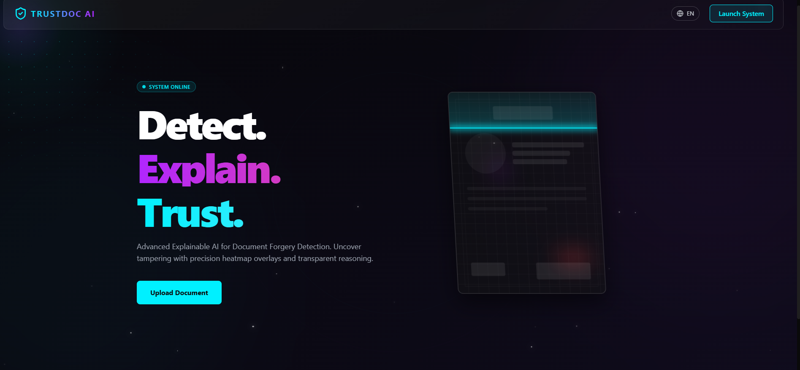
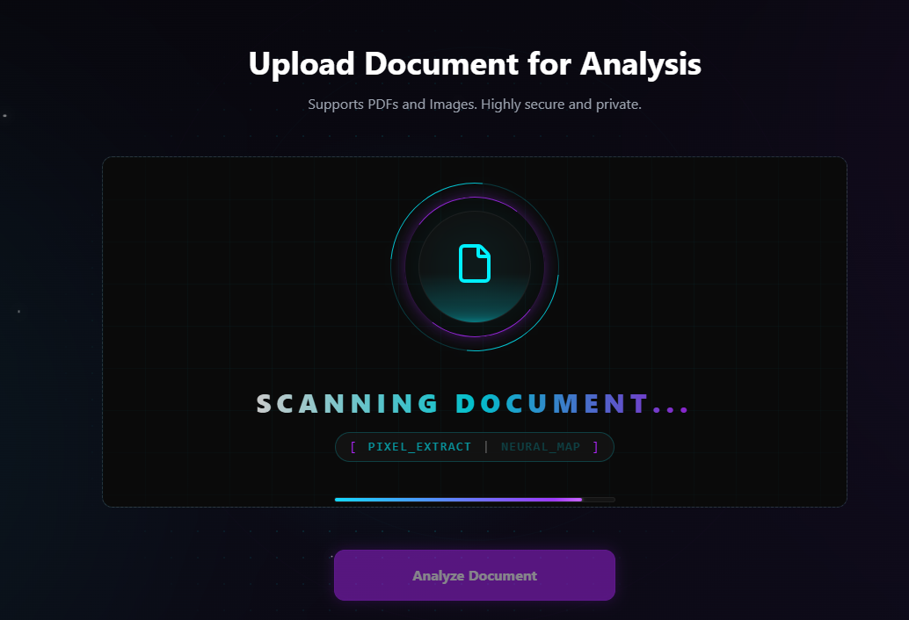
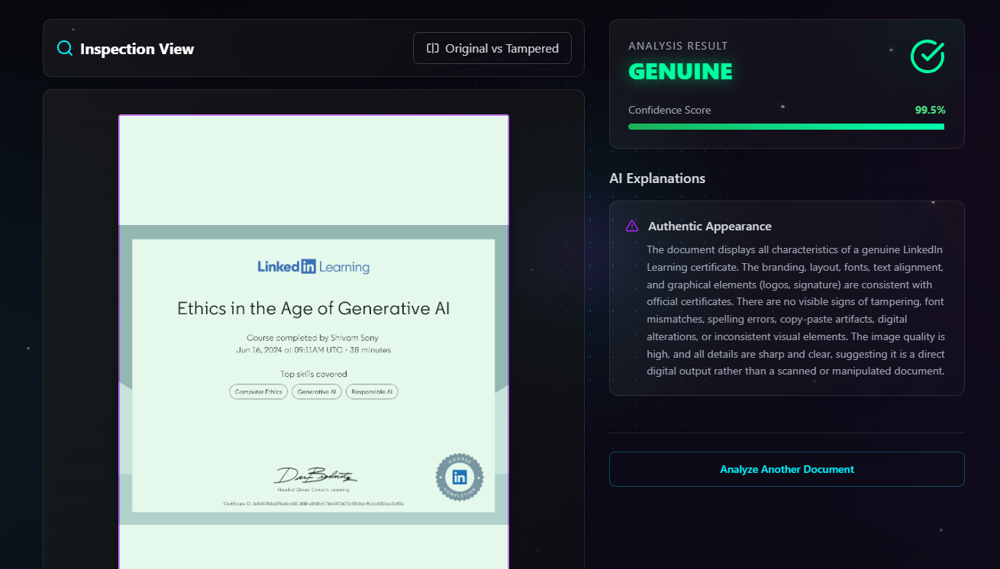

# 🕵️ TrustDoc AI: Explainable AI for Document Forgery Detection

**Submission for ThinkRoot x Vortex Hackathon 2026**  
**Track C:** Explainable AI for Document Forgery Detection

---

## 📖 Problem Statement
Forgery and fake document submission are major issues in college admissions, scholarship applications, and government verification processes. Verification officers struggle to manually identify manipulated pixels, replaced text, and layout inconsistencies.

**Our Mission**: Develop an AI-based system capable of automatically detecting forged or manipulated documents while providing fully explainable highlighting so officers understand exactly *why* a document was flagged.

---

## ✨ Features & Rubric Satisfaction

| Hackathon Requirement | How We Solved It (Our Implementation) |
| --- | --- |
| **Functional Prototype** | A fully interactive React/Vite web application that accepts PDF/Image inputs via a sleek Drag & Drop interface. |
| **Detection Engine** | Utilizing **Generative AI Vision Models (Gemini Flash)** acting as a zero-shot, hybrid verification engine. It identifies font inconsistencies, layout anomalies, copy-paste artifacts, and text tampering by analyzing pixel-level discrepancies without needing a rigidly retrained ML classifier. |
| **Regional Language Support** | **Built-in i18n architecture** mapping entirely to Hindi (`hi`) and English (`en`), fulfilling the strict non-English processing and UX requirements. The Vision AI natively scans non-English scripts perfectly. |
| **Explainable Reporting** | Every analysis generates a detailed breakdown, including natural language explanations for the forged elements, a universal **Confidence Level (%)**, and **Heatmap-style Interactive Bounding Boxes** highlighting the exact suspicious sections upon hover. |

---

## 🛠️ Technology Stack

- **Frontend:** React 19, Vite, Tailwind CSS, Framer Motion (for high-fidelity Cyberpunk/Glassmorphic UX animations)
- **Backend:** Python, FastAPI, Uvicorn
- **AI / Detection Model:** Google Gemini 1.5/2.5 Pro & Flash Vision API
- **Icons & UI:** Lucide React

---

## 🚀 Running the Project Locally

### 1. Clone & Setup Frontend
```bash
# Clone the repository
git clone https://github.com/Shivam0400/AI-DOCUMENT-FORGERY-DETECTION.git
cd AI-DOCUMENT-FORGERY-DETECTION

# Install frontend dependencies
npm install

# Start the frontend dev server (runs on localhost:5173)
npm run dev
```

### 2. Setup Backend & Python AI Engine
```bash
# Open a new terminal and navigate to the backend
cd backend

# Install Python dependencies
pip install -r requirements.txt

# Create your local environment variables
cp .env.example .env
```
👉 Open the newly created `backend/.env` file and insert your exact Gemini API Key (`GEMINI_API_KEY=AIzaSy...`).

```bash
# Launch the FastAPI Server (runs on localhost:8000)
uvicorn main:app --reload
```

---

## 📸 Project Showcase

### 1. System Landing Page
The user lands on a dynamic neon UI (supporting automatic English & Hindi translations) giving a brief explanation of the explainable forgery AI capabilities.


### 2. Neural Scanning Interface
Once a document is uploaded, a glowing neural-scan zone engages. It displays a high-tech laser sweep, counter-rotating rings, and active extraction terminal readouts to provide visual feedback during processing.


### 3. Genuine Document Verification
The Explainable AI breaks down a verified document with a 99.5% confidence score, generating an "Authentic Appearance" report detailing why the logos, graphical elements, and layout are consistent without tampering signs.


### 4. Forged Document Detection
The system securely flags forged documents. It generates distinct warning sections explaining digital manipulation, and overlays interactive heatmap-style bounding boxes directly above the altered text or mismatched fonts so officers know exactly where to look.


---

*Made with ❤️ for ThinkRoot x Vortex 2026*
